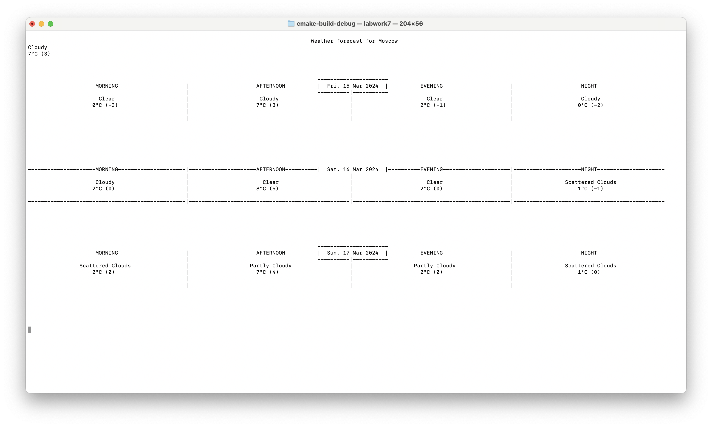

# WeatherForecast

Прогноз погоды. Внешние библиотеки.

Консольное приложение, отображающие прогноз погоды для выбранного списка городов (задается в ручную в процессе работы программы), используя сторонние библиотеки.

## Источник данных

- [Open-Meteo](https://open-meteo.com/en/docs#latitude=59.94&longitude=30.31&hourly=temperature_2m&forecast_days=16) для прогноза
- [Api-Ninjas](https://api-ninjas.com/api/city) для определения координат по названию города

## Функциональные возможности

 - Отображение прогноза погоды на несколько дней вперед (значение по умолчанию задается конфигом)
 - Обновление с некоторой частотой (задается конфигом)
 - Переключение между городами с помощью клавиш "n", "p"
 - Завершение работы программы по Esc
 - Увеличение\уменьшение количества дней прогноза по нажатию клавиш "+", "-"

Частота обновления, количество дней прогноза определяются в конфиге (формате json)

## Отображение

Визуализация представлена следующим форматом:

## Реализация

В качестве библиотеки для реализации простой визуализации используется ncurses

В качестве библиотеки для [HTTP-запросов](https://en.wikipedia.org/wiki/HTTP) используется [C++ Requests](https://github.com/libcpr/cpr)

Программа корректно обрабатывает коллизии и краевые случаи.
